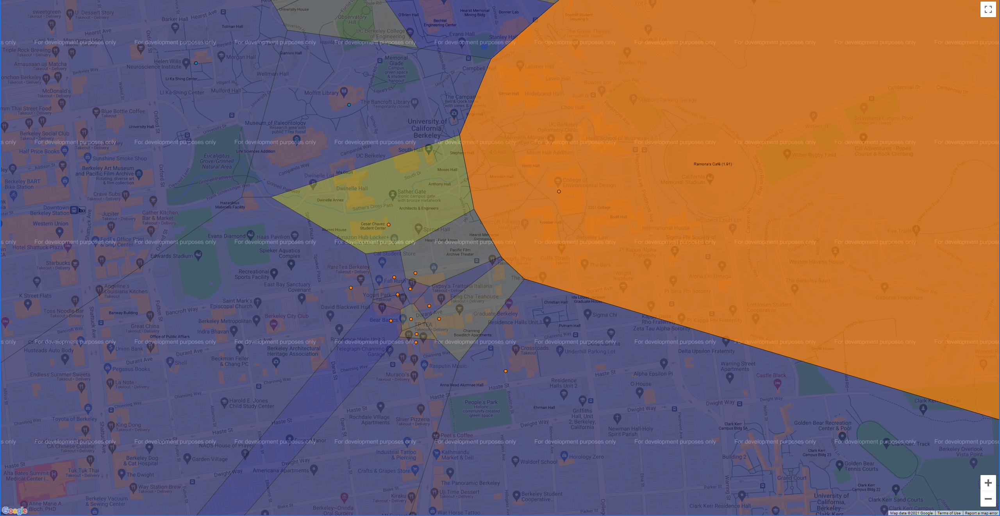

# YelpMaps

A Voronoi diagram visualization of restaurant ratings using machine learning and the Yelp academic dataset. 
In this visualization, the city of Berkeley, CA is segmented into regions, where each region is 
shaded by the predicted rating of the closest restaurant (yellow is 5 stars, blue is 1 star). 

## Example

The following command visualizes all sandwich restaurants and their predicted ratings for the user who `likes_expensive` restaurants:

`python3 recommend.py -u likes_expensive -k 2 -p -q Sandwiches`

